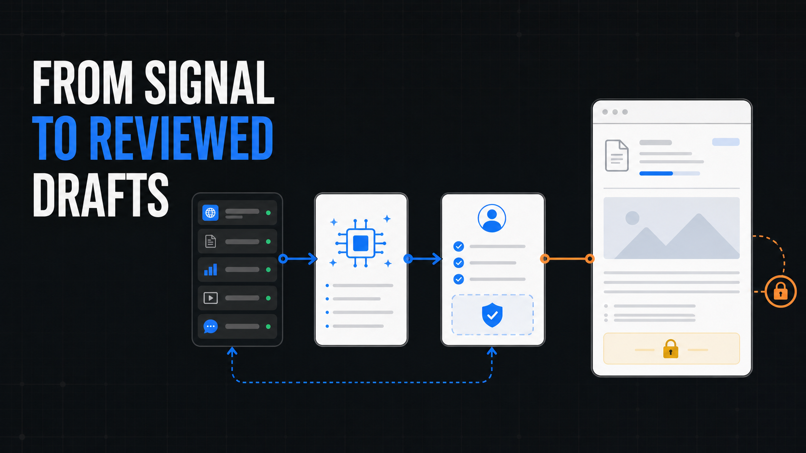
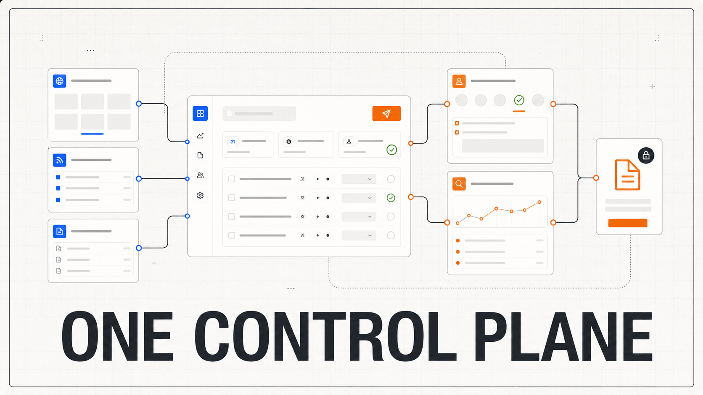
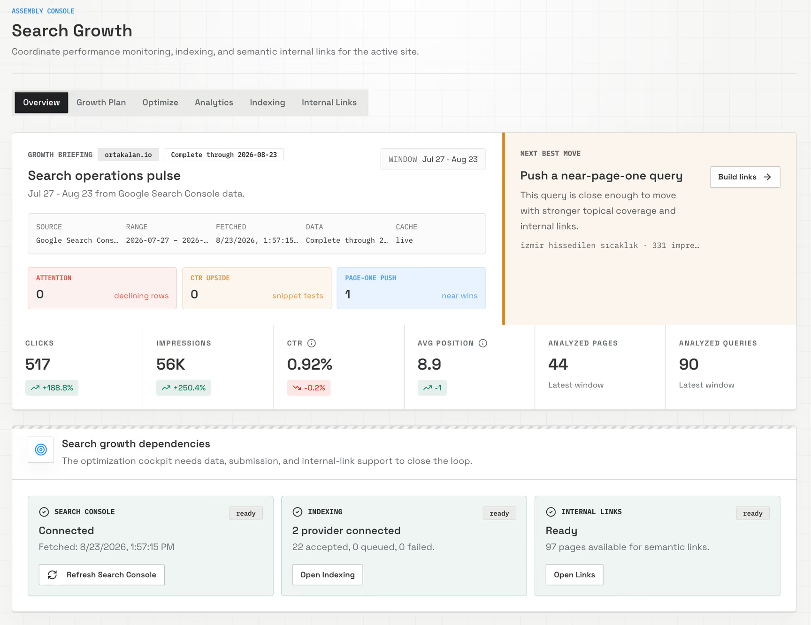
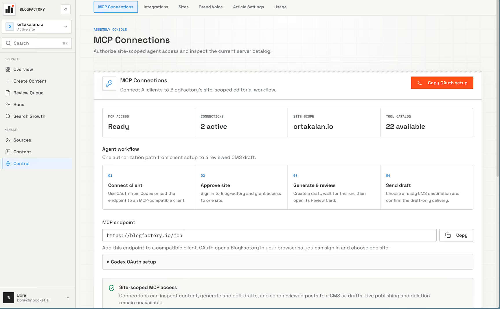

<p align="center">
  <a href="https://blogfactory.io">
  
  </a>
</p>

<h1 align="center">BlogFactory</h1>

<p align="center">
  <strong>The draft-only agent control plane for multi-site content operations.</strong><br />
  Give agents useful authority through MCP. Keep people in control of review, approval, and CMS delivery.
</p>

<p align="center">
  <a href="https://blogfactory.io">Website</a> ·
  <a href="docs/self-hosting.md">Self-host</a> ·
  <a href="docs/mcp.md">MCP guide</a> ·
  <a href="FEATURE_PLAN.md">Release plan</a> ·
  <a href="LICENSE">AGPL-3.0-only</a>
</p>

<p align="center">
  <code>Self-hosted</code>
  <code>Bring your own AI</code>
  <code>Site-scoped access</code>
  <code>Never publishes live</code>
</p>

<p align="center">
  
</p>

## A calmer content operation

BlogFactory keeps the operating context around AI-assisted content work in one place: source evidence, drafts, revisions, SEO metadata, review, preflight, delivery destination, and a sanitized operation record.

```text
source evidence
  → agent work or caller-authored draft
  → revision + SEO metadata
  → human review + preflight
  → selected CMS destination as a draft
```

Agents do the work through MCP. The web app is where operators see what needs attention, resolve blockers, review the current version, and approve a CMS handoff. The server-enforced authority ceiling is intentionally narrow: no live publishing, deletes, credential access, arbitrary providers, or admin tools through MCP.

<p align="center">
  
</p>

## Product captures

<p align="center">
  
</p>

### Search Growth turns evidence into reviewed action

Connect Search Console context, distinguish complete from preliminary data, rank work, plan it by date, and create a draft only when an operator is ready. Observation windows are shown as correlated signals, never as ranking guarantees.

<p align="center">
  
</p>

### MCP has useful authority and hard boundaries

Each connection is site-scoped. Clients discover the active catalog from the server, while provider credentials stay outside the agent conversation. The Review Card brings current revision context, warnings, destination selection, and explicit draft confirmation into compatible MCP clients.

<p align="center"><sub>Product captures from <a href="https://blogfactory.io">blogfactory.io</a>. Values belong to the captured workspace; the tool catalog is discovered live.</sub></p>

## What ships in the release candidate

| Operate | Grow | Control | Deliver |
| --- | --- | --- | --- |
| Sources, content inventory, revisions, review queue, runs, and image workflows | Search Console diagnostics, optimization, growth plans, indexing, and internal links | Site-scoped access, MCP connections, integrations, brand voice, settings, usage, and audit history | Preflight, explicit destination selection, optimistic locking, idempotent CMS **draft** delivery |

BlogFactory is a self-hosted release candidate. BlogFactory Cloud is coming soon; pricing, subscriptions, checkout, and hosted public account creation are not implemented. Read the [release plan](FEATURE_PLAN.md) for the remaining public-release gates.

## Companion projects

Explore both projects in the [Free & Open Source Tools hub](https://blogfactory.io/open-source-tools/).

| Project | Use it when |
| --- | --- |
| [Ghost Publisher MCP](https://github.com/BlogFactoryHQ/ghost-publisher-mcp) | You need a local, Ghost-specific MCP server for drafts, diagnostics, scheduling, and separately approved publishing. [Overview and install](https://blogfactory.io/open-source-tools/ghost-publisher-mcp/) |
| [Source-Backed Blog Writer](https://github.com/BlogFactoryHQ/source-backed-blog-writer-skill) | You need a portable Agent Skill for researching, drafting, refreshing, or auditing evidence-backed articles. [Overview and install](https://blogfactory.io/open-source-tools/source-backed-blog-writer/) |

Both projects work independently. They can supply or deliver content around BlogFactory, but they do not broaden BlogFactory's server-enforced draft-only authority.

## Start locally

BlogFactory uses npm workspaces: a React/Vite web app and a Hono/TypeScript API, backed by PostgreSQL and S3-compatible storage.

```bash
git clone https://github.com/BlogFactoryHQ/blogfactory.git
cd blogfactory
npm install
cp .env.example .env
npm run db:migrate
npm run dev
```

The web app runs on `http://localhost:8080` and the API on `http://localhost:3000`. Add only the credentials required for the flow you are testing; never point PostgreSQL integration tests at a shared production database.

## Self-host with Docker

```bash
git clone https://github.com/BlogFactoryHQ/blogfactory.git
cd blogfactory
cp .env.self-host.example .env
# Fill every required value and set ADMIN_EMAILS.
docker compose build --pull api web
docker compose up -d
```

The verified topology includes the web app, API, PostgreSQL, MinIO, migrations, persistent volumes, and the bounded scheduler. Follow the full [self-hosting guide](docs/self-hosting.md) before exposing an instance to the internet.

## How the system is shaped

```text
operators ── <instance-origin> ─────┐
                                    ├─ shared tenant-scoped services ─ PostgreSQL + S3-compatible storage
agents ───── <instance-origin>/mcp ─┘                                   └─ CMS drafts / Search Console / configured AI providers
```

Web and MCP are transports over the same services. Queue classification, revision rules, review preflight, Search Console reads, permissions, and CMS draft delivery are not duplicated in the UI or agent tools.

| Surface | Purpose |
| --- | --- |
| [Marketing](https://blogfactory.io) | Open-source product overview and Cloud launch updates |
| [Authenticated app](https://app.blogfactory.io) | Operations, review, growth, settings, and audit |
| `https://blogfactory.io/mcp` | Streamable HTTP agent work layer |
| `/.well-known/oauth-protected-resource` | MCP protected-resource discovery |

## Documentation

- [Architecture and service ownership](docs/architecture.md)
- [MCP, OAuth, tool catalog, and Review Card](docs/mcp.md)
- [Operations, deployment, and production acceptance](docs/operations.md)
- [Self-hosting with Docker Compose](docs/self-hosting.md)
- [Release plan and Cloud boundaries](FEATURE_PLAN.md)
- [Documentation index](docs/README.md)
- [Contributing](CONTRIBUTING.md)

## Development checks

```bash
npm run typecheck
npm run lint --workspace=web
npm run test --workspace=web
npm run test:server
npm run build
git diff --check
```

Database, tenancy, ledger, and shared control-plane changes also require `npm run test:postgres` against a disposable database.

---

BlogFactory is licensed under [AGPL-3.0-only](LICENSE).
